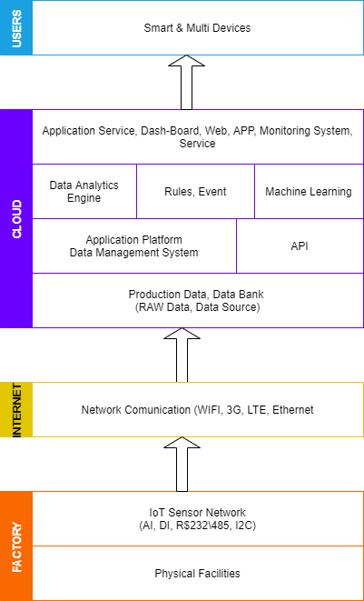

## :trophy: C0.2 Reto en clase

**Conceptos de Industria 4.0 e IOT**

### :blue_book: Instrucciones

- De acuerdo con la información presentada y el video mostrado por el asesor, contestar las preguntas indicadas en la tabla del apartado desarrollo.
- Al concluir el reto se deberá subir en formato PDF a la plataforma con la nomenclatura **C0.2_NombreApellido_Equipo.pdf.**
- Se deberá publicar el reto dentro del repositorio Git personal de cada estudiante, utilizando el estilo MarkDown y el entorno de desarrollo VSCode.
- Es recomendable crear el repositorio siguiente una estructura tal como:
```
- readme.md
  - blog
    - C0.1_x.md
    - C0.2_x.md
  - img
  - docs
    - A0.1_x.md
    - A0.2_x.md
```
  
### :pencil2: Desarrollo

1. Responde a las siguientes preguntas:

| Numero | Pregunta                                            | Respuesta  |
| ------ | --------------------------------------------------- | ---------  |
| 1.1      | A que esta referido el termino Industria conectada? |Se refiere a la intregracion de medios maquinas capaces de comunicarse y compartir informacion, de esta manera poder automatizar aun mas procesos que antes no eran posibles, por medio de señales inalanbricas que podran enviar y recibir a lo largo de la fabrica.|
| 1.2      | ¿Qué es un sistema en tiempo real?                  |Un sistema en tiempo real es aquel que toma medidas a implementar en cuanto le llega la informacion, si dentro de la fabrica una maquina indica que se esta acabando el material, automaticamente se deberia hacer la orden de nuevo material.|
| 1.3      | Mencione que tecnologías envuelven el concepto Industria 4.0    |Inpresión 3D, integracion de procesos, Ciberseguridad, Realidad Aumentada, Cloud Computing, Robótica, Internet de las cosas, Big data y Análisis de datos, Simulacion y prototipado|
| 1.4      | Referente al tema automatización industria, en que consiste el nivel de campo?                        |Consiste en sensores, actuadores, temporizadores, contadores y toda la maquinaria y equipo que se disponga para la producción|
| 1.5      | Elabore un diagrama de capas que muestre la arquitectura de un ecosistema tecnológico para IOT?                       |            |
| 1.6      | Que es un sistema de control embebido?         |Son sistemas de control que manejan funciones ligeras para controlar controlar dispositivos hardware, como podria ser un sistema para controlar un aire acondicionado.|
| 1.7      | Que tecnologías observa en el video referentes al concepto Industria 4.0?         |            |
| 1.8      | Basado en el video que ha ofrecido la robótica en la industria?        |Grandes beneficios en la reduccion de costos y a evitar accidentes.|

1. Instale la extension [Draw.io integration](https://marketplace.visualstudio.com/items?itemName=hediet.vscode-drawio) dentro de visual studio code y elabore el diagrama solicitado siguiendo las instrucciones para esta actividad.

    :arrow_forward: [Extension de visual studio code - Draw.io integration](https://www.youtube.com/watch?v=Y47ZlxoDWNI)

2. Coloque el diagrama que se solicita dentro del punto 1.5 en este apartado.
   -Ejemplo de un diagrama de flujo utilizando draw.io



:house: [Ir a inicio](../docs/D0.1_FundamentosElectronicaBasica.md)