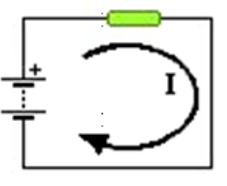

## :trophy: C1.2 Reto en clase

**Conceptos de electrónica básica y circuitos**

### :blue_book: Instrucciones
___

- De acuerdo con la información presentada por el asesor referente al tema electrónica básica, contestar las preguntas indicadas dentro del apartado desarrollo.
- Toda actividad o reto se deberá realizar utilizando el estilo **MarkDown con extension .md** y el entorno de desarrollo VSCode, debiendo ser elaborado como un documento **single page**, es decir si el documento cuanta con imágenes, enlaces o cualquier documento externo debe ser accedido desde etiquetas y enlaces.
- Es requisito que el archivo .md contenga una etiqueta del enlace al repositorio de su documento en Github, por ejemplo **Enlace a mi GitHub**
- Al concluir el reto el reto se deberá subir a github el archivo .md creado.
- Desde el archivo **.md** se debe exportar un archivo **.pdf** con la nomenclatura **C1.2_NombreAlumno_Equipo.pdf**, el cual deberá subirse a classroom dentro de su apartado correspondiente, para que sirva como evidencia de su entrega; siendo esta plataforma **oficial** aquí se recibirá la calificación de su actividad por individual.
- Considerando que el archivo .pdf, fue obtenido desde archivo .md, ambos deben ser idénticos y mostrar el mismo contenido.
- Su repositorio ademas de que debe contar con un archivo **readme**.md dentro de su directorio raíz, con la información como datos del estudiante, equipo de trabajo, materia, carrera, datos del asesor, e incluso logotipo o imágenes, debe tener un apartado de contenidos o indice, los cuales realmente son ligas o **enlaces a sus documentos .md**, _evite utilizar texto_ para indicar enlaces internos o externo.
- Se propone una estructura tal como esta indicada abajo, sin embargo puede utilizarse cualquier otra que le apoye para organizar su repositorio.

``` 
| readme.md
| | blog
| | | C0.1_x.md
| | | C0.2_x.md
| | | C0.3_x.md
| | img
| | docs
| | | A0.1_x.md
| | | A0.2_x.md
```

### :pencil2: Desarrollo
___
1. Analizar los tres siguientes circuitos y responder a lo que se pregunta en cada uno de ellos, **explicando** como se obtuvo el resultado.

+ Un circuito que tiene una pila de 6 voltios genera una corriente que atraviesa una resistencia eléctrica de 2 ohmios. Cual es el valor de la intensidad de la corriente que pasa por la resistencia?
  
   
    Elemento | Valor | 
    ---------|----------|
    R | 2 ohms | 
    V | 6 v | 
    IR | ? | 



    Lo que buscamos es IR por loque la formula que 
    necesitamos es:

    I = V / R

    Sustituimos los datos y nos queda:

    IR = 6 v / 2 ohms

    Dandonos como resultado "3 amperes".

+ Hallar la tension de la pila que necesitas para que pase una corriente cuya intensidad es de 3 amperes por una bombilla que tiene 2 ohmios de resistencia.

    Elemento | Valor | 
    ---------|----------|
    V | ? | 
    I | 3 amp | 
    R | 2 ohms |


    Ahora buscamos los voltios por lo que ahora vamos 
    a usar la formula.

    V = I * R

    Sustituyendo queda:

    V = 3 amp * 2 ohms

    Dando como resultado "6 volteos".

+ Calcular la corriente eléctrica total y el voltaje en cada resistencia 

    Elemento | Valor | 
    ---------|----------|
    R1 | 80 ohms | 
    R2 | 120 ohms | 
    R3 | 12 ohms | 
    VT | 60 volts | 
    VR1 | ? | 
    VR2 | ? | 
    VR3 | ? | 
    IT |  ? | 


    Para conseguir la resistencia total como estan en 
    serie las resistencias solo se suman las resistencias.

    RT = 80 ohm + 120 ohm + 12 ohm = 212 omh

    Para calcular las resistencias individuales, 
    primero calculamos la intensidad total con la 
    formula I = V / R.

    IT = 60v / 212 volts = 0.283 amp

    Una vez calculada la intensidad total podemos 
    calcular los voltajes que recibe cada 
    resistencias.

    Vamos a utilizar la formula V = I * R usando la IT.

    VR1 = 0.28amp * 80omh = 22.64volts

    VR2 = 0.28amp * 120omh = 33.96volts

    VR3 = 0.28amp * 12omh = 3.396volts

    Sumamos para comprobar.

    VT = 22.64volts + 33.96volts + 3.396volts = 59.996v


___

### :bomb: Rubrica

| Criterios     | Descripción                                                                                  | Puntaje |
| ------------- | -------------------------------------------------------------------------------------------- | ------- |
| Instrucciones | Se cumple con cada uno de los puntos indicados dentro del apartado Instrucciones?            | 20 |
| Desarrollo    | Se respondió a cada uno de los puntos solicitados dentro del desarrollo de la actividad?     | 80      |

___

### :bookmark: Ligas


:memo: [Ir a mi documento en  GitHub]([../README.md](https://github.com/CotaVilla/Sistemas-Programables/blob/master/blog/C1.2_EdyCota_Dream_Team.md))


:house: [Ir a inicio](../README.md)


:school: [Ir a mi repositorio (Pagina)](https://github.com/CotaVilla/Sistemas-Programables)