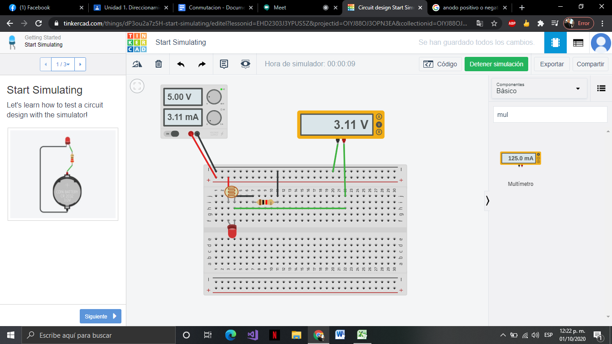
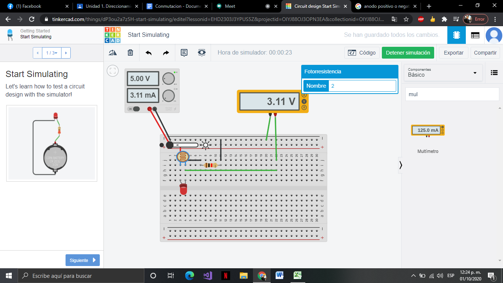
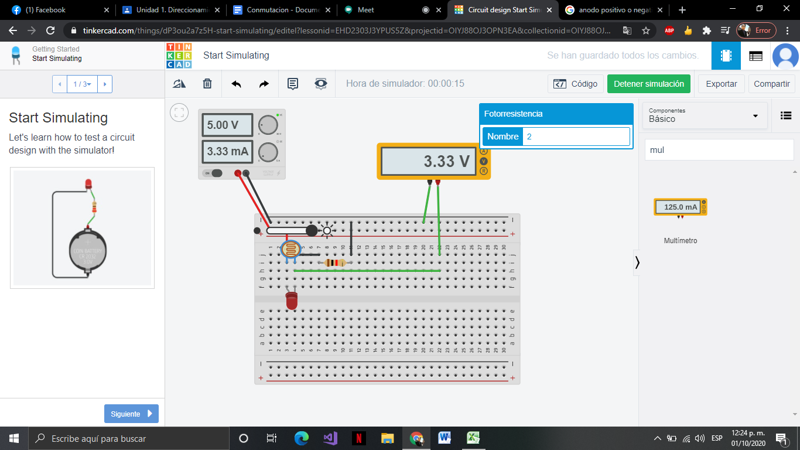

# Introducción

## :trophy: A.1.2 Actividad de aprendizaje

## Objetivo

Realizar un sensor medidor de luz (lux) a través de un circuito electrónico, utilizando un simulador, y  un **LDR (Light dependent Resistor)**.

### :blue_book: Instrucciones

- Se sugiere para el desarrollado de la presenta actividad, utilice uno de los siguientes simuladores: [Autodesk Tinkercad](https://www.tinkercad.com/), [Virtual BreadBoard](http://www.virtualbreadboard.com/), [Easy EDA](https://easyeda.com/) por lo cual habrá que familiarizarse antes, e incluso instalarse o registrarse dentro de la plataforma.
- Toda actividad o reto se deberá realizar, utilizando el estilo **MarkDown con extension .md** y el entorno de desarrollo VSCode, debiendo ser elaborado como un documento **single page**, es decir si el documento cuanta con imágenes, enlaces o cualquier documento externo debe ser accedido desde etiquetas y enlaces, y debe ser nombrado con la nomenclatura **A1.2_NombreApellido_Equipo.pdf.**
- Es requisito que el .MD contenga una etiqueta del enlace al repositorio de su documento en GITHUB, por ejemplo **Enlace a mi GitHub** y al concluir el reto se deberá subir a github.
- Desde el archivo **.md** exporte un archivo **.pdf** que deberá subirse a classroom dentro de su apartado correspondiente, sirviendo como evidencia de su entrega, ya que siendo la plataforma **oficial** aquí se recibirá la calificación de su actividad.
- Considerando que el archivo .PDF, el cual fue obtenido desde archivo .MD, ambos deben ser idénticos.
- Su repositorio ademas de que debe contar con un archivo **readme**.md dentro de su directorio raíz, con la información como datos del estudiante, equipo de trabajo, materia, carrera, datos del asesor, e incluso logotipo o imágenes, debe tener un apartado de contenidos o indice, los cuales realmente son ligas o **enlaces a sus documentos .md**, _evite utilizar texto_ para indicar enlaces internos o externo.
- Se propone una estructura tal como esta indicada abajo, sin embargo puede utilizarse cualquier otra que le apoye para organizar su repositorio.
  
```
- readme.md
  - blog
    - C0.1_x.md
    - C0.2_x.md
  - img
  - docs
    - A0.1_x.md
    - A0.2_x.md
    - A1.2_x.md
    - A1.3_x.md
```


### :pencil2: Desarrollo

1. Utilice el siguiente listado de materiales para la elaboración de la actividad y agregue en la columna Fuente de consulta su enlace _bibliográfico_.

    | Cantidad | Descripción                      | Fuente de consulta |
    | -------- | -------------------------------- | ------------------ |
    | 1        | Sensor Fotoresistencia LDR de 2M |[Fotoresistencia](https://www.sparkfun.com/datasheets/Sensors/Imaging/SEN-09088-datasheet.pdf)|
    | 1        | Resistencia 1k                   |[Resistencia](https://www.digchip.com/datasheets/parts/datasheet/1838/CFR-25JB-1K0-pdf.php)|
    | 1        | Fuente de alimentación de 5v.    |[Fuente variable stp3005d](https://static.rapidonline.com/pdf/554305_v1.pdf)|

2. Considerando que el elemento LDR es un sensor fotoresistivo es decir varia su resistencia en base a la cantidad de luz que incide sobre el, **Que observa en el grafico siguiente?** 
   
<p align="center">
    
</p>

**Que cuando hay menos iluminacion las fotoresistencia opone mas resistencia y cuando hay mas luz opone mas resistencia.**

3. Ensamble el circuito que se muestra utilizado el simulador que halla considerado, colocando la fotorresistencia en la posición LDR y resistencia de acuerdo con la imagen del esquemático:

    <p align="center"> 
        
    </p>
4. coloque la imagen finalmente obtenida del circuito ensamblado dentro de su simulador.

<p align="center">
    
</p>

[Link a a la simulacion](https://www.tinkercad.com/things/dP3ou2a7z5H-start-simulating/editel?lessonid=EHD2303J3YPUS5Z&projectid=OIYJ88OJ3OPN3EA&collectionid=OIYJ88OJ3OPN3EA&sharecode=10HC6Ck1FtncHw_ABwvVHeOE7rtqYxFCo8aVI0nvywE&fbclid=IwAR1oWg5_KQDXONVyDuXyOVpUhY4L0Iie5ft0fyJ3i3TZmtWR9xEtqN5z4GA)

5. Mida la **resistencia** de la fotorresistencia con el ohmetro bajo las siguientes condiciones: ausencia de luz u oscuridad,  luz ambiente, luz intensiva y registre en la tabla correspondiente.

**Oscuridad**

<p align="center">
    
</p>

**Luz Ambiente**

<p align="center">
    
</p>

**Luz intensiva**

<p align="center">
    
</p>

7. Calcule el **valor de voltaje Vout teórico** para cada una de las condiciones antes indicadas asi como el valor de voltaje Vout medido  y registre en la tabla correspondiente.
8. Calcule el **valor de exactitud** de voltaje entre lo teórico y lo medido para cada condición  y registre en la tabla correspondiente.

    | Condicion          |  Impedancia en fotoresistencia | Voltaje Vout teórico | Voltaje Vout medido | %  V.Medido/ V.Teórico |
    | --------------- | ----------------------------- | -------------------- | ------------------- | ---------------------- |
    | Ausencia de luz |180,000 ohm|0.0276v|0.0277v|0.0277v / 0.0276v = 100.3%
    | Luz ambiental   |900 ohm|2.63v|2.61v|2.61v / 2.63v = 99%
    | Luz intensa     |506 omh|3.32v|3.32v|3.32v / 3.32v = 100%

9. **Grafique** a través de los valores registrados en la tabla anterior de tal manera que se pueda observar el comportamiento de la curva del componente LDR e **inserte la grafica**.

<p align="center">
    
</p>

10. Inserte imágenes de **evidencias** tales como son reuniones  de los integrantes del equipo realizadas para el desarrollo de la actividad

<p align="center">
    
</p>

<p align="center">
    
</p>

11. Incluya las conclusiones individuales y resultados observados durante el desarrollo de la actividad.

Fernando Esau Melendez Palafox

A traves de esta practica realizada con simulador utilizando una fuente de voltaje de 5 voltios conectada a un foto resistor en serie a una resistencia de 1 kohms para medir el voltaje de salida, y comparar los datos reales con los logicos sacados a traves de una formula. Al principio hubieron problemas al obtener los datos y los valores variaban demasiado, el problema radicaba en la mala aplicacion de la formula por mi parte pero nada grave, todo empezaba a tomar sentido al volver a realizar los calculos. La practica fue facil, lo mas tardado fue acomodar la informacion, graficar y todo lo demas solicitado en la practica.

Jaramillo Regino Hector Armando

En la práctica utilizamos como componente principal un fotoresistor el cual mientras menos luz detecte más resistencia opone en el circuito, al inicio creía que funcionaba de manera inversa, además en lugar de hacer un arreglo de resistencias para nivelar voltaje de una batería 9 voltios optamos por utilizar una fuente variable y asignamos el amperaje de una batería de 9 voltios, incluimos los cálculos teóricos utilizando la fórmula marcada en el documento, finalmente comparamos los resultados con los arrojados por el circuito y lo graficamos.


Cota Villa Edy Jesus Manuel

En la practica aplicamos una fotoresistencia dentro de un circuito, qui podemos observar como la resistencia bajaba a como recibia luz, la resistencia que ofrece una fotoresistencia puede impedir casi completamente el flujo de energia en la noche y casi por completo desaparecer en el dia. En el circuito, terminamos utilizando una fuente variable como si fuera la batería  de 5v.

### :bomb: Rubrica

| Criterios     | Descripción                                                                                  | Puntaje |
| ------------- | -------------------------------------------------------------------------------------------- | ------- |
| Instrucciones | Se cumple con cada uno de los puntos indicados dentro del apartado Instrucciones?            | 10      |  | 5 |
| Desarrollo    | Se respondió a cada uno de los puntos solicitados dentro del desarrollo de la actividad?     | 60      |
| Demostración  | El alumno se presenta durante la explicación de la funcionalidad de la actividad?            | 20      |
| Conclusiones  | Se incluye una opinión personal de la actividad  por cada uno de los integrantes del equipo? | 10      |

___

### :bookmark: Ligas

:memo: [Ir a mi documento en  GitHub](https://github.com/CotaVilla/Sistemas-Programables/blob/master/docs/A1.2_CotaVillaEdyJesusManuel.md)


:house: [Ir a inicio (Readme)](../README.md)


:school: [Ir a mi repositorio (Pagina)](https://github.com/CotaVilla/Sistemas-Programables)
